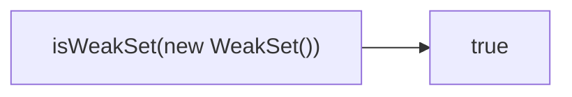

Checks if value is a WeakSet.
**Deprecated**: Use `instanceof WeakSet` directly.

```mermaid
flowchart LR
    A["isWeakSet(new WeakSet())"] --> B["true"]
```

### Native Equivalent

```typescript
// ❌ isWeakSet(value)
// ✅ value instanceof WeakSet
```
