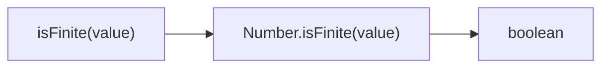
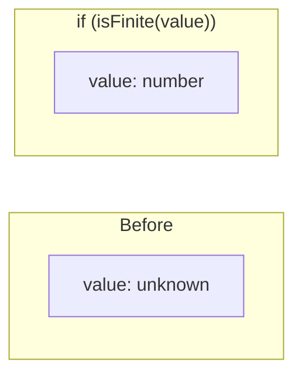

Checks if value is a finite number.

### Type Narrowing

### Common Checks

| Value | Result |
|-------|--------|
| `42` | ✅ true |
| `3.14` | ✅ true |
| `Infinity` | ❌ false |
| `-Infinity` | ❌ false |
| `NaN` | ❌ false |
| `'42'` | ❌ false |

> ⚠️ **Deprecated**: Use `Number.isFinite()` directly.
