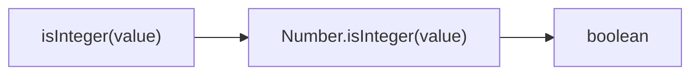
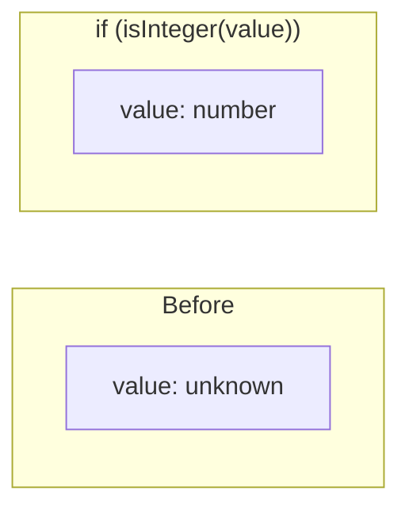

Checks if value is an integer.

### Type Narrowing

### Common Checks

| Value | Result |
|-------|--------|
| `42` | ✅ true |
| `42.0` | ✅ true |
| `42.5` | ❌ false |
| `'42'` | ❌ false |
| `Infinity` | ❌ false |

> ⚠️ **Deprecated**: Use `Number.isInteger()` directly.
