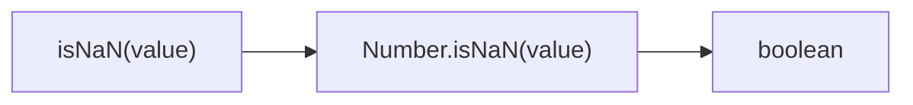
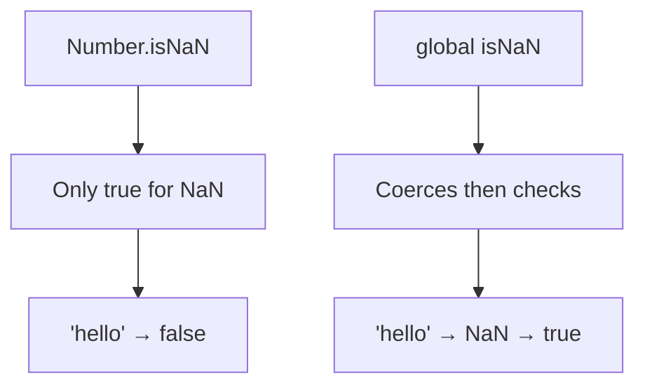

Checks if value is NaN.

### Difference from Global isNaN

### Common Checks

| Value | Result |
|-------|--------|
| `NaN` | ✅ true |
| `undefined` | ❌ false |
| `'NaN'` | ❌ false |
| `null` | ❌ false |
| `42` | ❌ false |

> ⚠️ **Deprecated**: Use `Number.isNaN()` directly.
