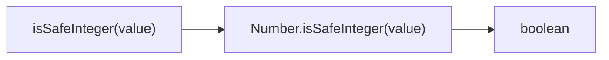
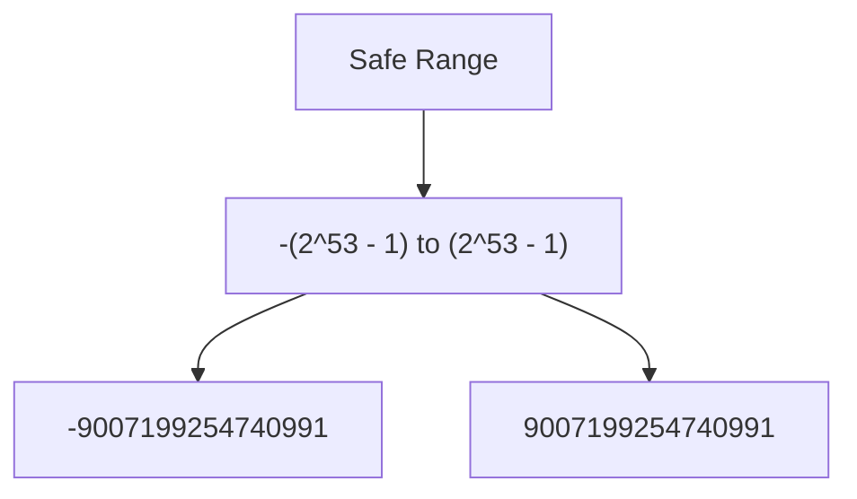

Checks if value is a safe integer (exactly representable in IEEE-754).

### Safe Integer Range

### Common Checks

| Value | Result |
|-------|--------|
| `42` | ✅ true |
| `9007199254740991` | ✅ true (MAX_SAFE_INTEGER) |
| `9007199254740992` | ❌ false |
| `3.14` | ❌ false |
| `Infinity` | ❌ false |

> ⚠️ **Deprecated**: Use `Number.isSafeInteger()` directly.
