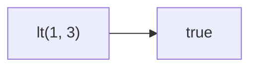

Checks if value is less than other.
**Deprecated**: Use `<` operator directly.

```mermaid
flowchart LR
    A["lt(1, 3)"] --> B["true"]
```

### Native Equivalent

```typescript
// ❌ lt(a, b)
// ✅ a < b
```
