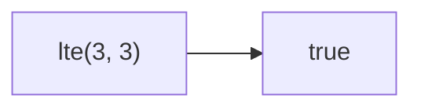

Checks if value is less than or equal to other.
**Deprecated**: Use `<=` operator directly.

```mermaid
flowchart LR
    A["lte(3, 3)"] --> B["true"]
```

### Native Equivalent

```typescript
// ❌ lte(a, b)
// ✅ a <= b
```
