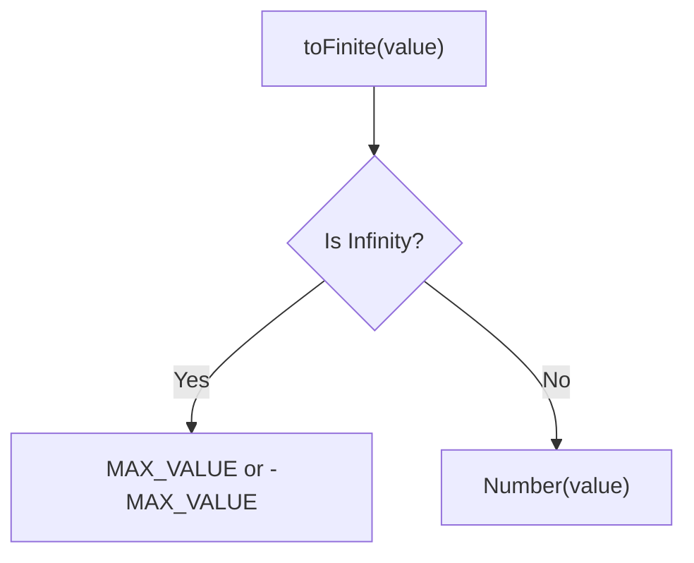

Converts value to a finite number.
**Deprecated**: Use combination of `Number()` and bounds check.


### Native Equivalent

```typescript
// ❌ toFinite(value)
// ✅ Math.max(-Number.MAX_VALUE, Math.min(Number.MAX_VALUE, Number(value)))
```
