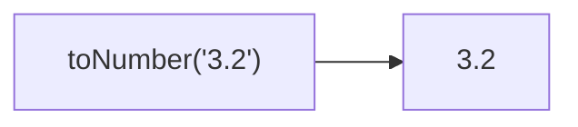

Converts value to a number.
**Deprecated**: Use `Number()` directly.

```mermaid
flowchart LR
    A["toNumber('3.2')"] --> B["3.2"]
```

### Native Equivalent

```typescript
// ❌ toNumber(value)
// ✅ Number(value)
// ✅ +value
// ✅ parseFloat(value)
```
