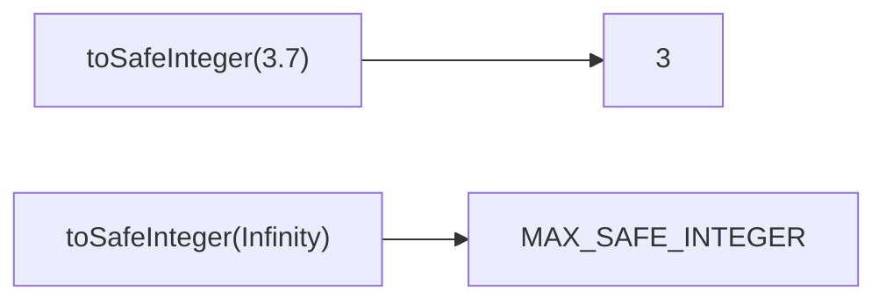

Converts value to a safe integer.
**Deprecated**: Use `Math.trunc()` with bounds check.


### Native Equivalent

```typescript
// ❌ toSafeInteger(value)
// ✅ Math.max(
//      Number.MIN_SAFE_INTEGER,
//      Math.min(Number.MAX_SAFE_INTEGER, Math.trunc(value))
//    )
```
