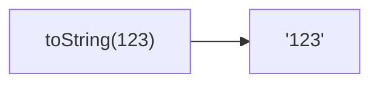

Converts value to a string.
**Deprecated**: Use `String()` directly.

```mermaid
flowchart LR
    A["toString(123)"] --> B["'123'"]
```

### Native Equivalent

```typescript
// ❌ toString(value)
// ✅ String(value)
// ✅ value.toString()
// ✅ `${value}`
```
