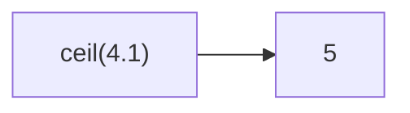

Rounds number up to specified precision.
**Deprecated**: Use `Math.ceil()` directly.

```mermaid
flowchart LR
    A["ceil(4.1)"] --> B["5"]
```

### Native Equivalent

```typescript
// ❌ ceil(value)
// ✅ Math.ceil(value)
```
