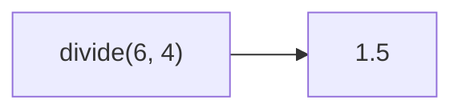

Divides two numbers.
**Deprecated**: Use the `/` operator directly.

```mermaid
flowchart LR
    A["divide(6, 4)"] --> B["1.5"]
```

### Native Equivalent

```typescript
// ❌ divide(6, 4)
// ✅ 6 / 4
```
