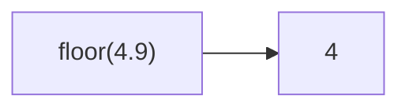

Rounds number down to specified precision.
**Deprecated**: Use `Math.floor()` directly.

```mermaid
flowchart LR
    A["floor(4.9)"] --> B["4"]
```

### Native Equivalent

```typescript
// ❌ floor(value)
// ✅ Math.floor(value)
```
