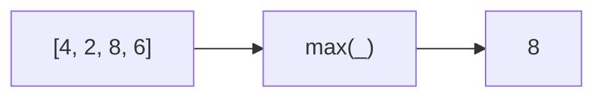

Computes the maximum value of array.
**Deprecated**: Use `Math.max(...array)` directly.

```mermaid
flowchart LR
    A["[4, 2, 8, 6]"] --> B["max(_)"]
    B --> C["8"]
```

### Native Equivalent

```typescript
// ❌ max(arr)
// ✅ Math.max(...arr)
```
