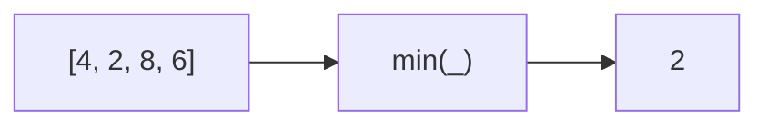

Computes the minimum value of array.
**Deprecated**: Use `Math.min(...array)` directly.

```mermaid
flowchart LR
    A["[4, 2, 8, 6]"] --> B["min(_)"]
    B --> C["2"]
```

### Native Equivalent

```typescript
// ❌ min(arr)
// ✅ Math.min(...arr)
```
