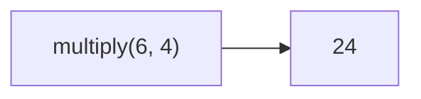

Multiplies two numbers.
**Deprecated**: Use the `*` operator directly.

```mermaid
flowchart LR
    A["multiply(6, 4)"] --> B["24"]
```

### Native Equivalent

```typescript
// ❌ multiply(6, 4)
// ✅ 6 * 4
```
