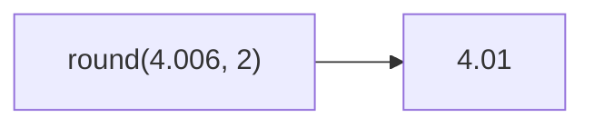

Rounds number to specified precision.
**Deprecated**: Use `Math.round()` directly.


### Native Equivalent

```typescript
// ❌ round(value)
// ✅ Math.round(value)
// ✅ Math.round(value * 100) / 100  // for precision
```
