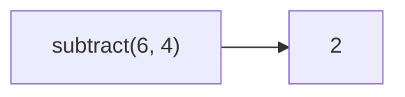

Subtracts two numbers.
**Deprecated**: Use the `-` operator directly.

```mermaid
flowchart LR
    A["subtract(6, 4)"] --> B["2"]
```

### Native Equivalent

```typescript
// ❌ subtract(6, 4)
// ✅ 6 - 4
```
