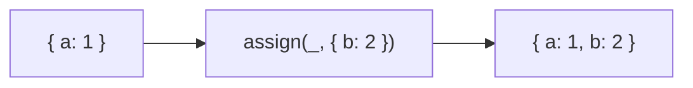

Assigns source properties to destination object.
**Deprecated**: Use `Object.assign()` or spread operator directly (ES2015).


### Native Equivalent

```typescript
// ❌ assign(target, source)
// ✅ Object.assign(target, source)
// ✅ { ...target, ...source }
```
