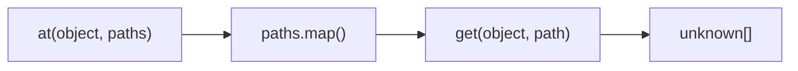
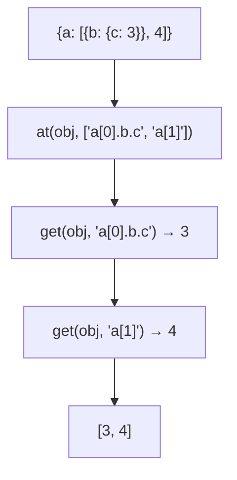

Creates an array of values at specified paths.

### Processing Flow

### Common Inputs

| Object | Paths | Result |
|--------|-------|--------|
| `{a: [{b: {c: 3}}, 4]}` | `['a[0].b.c', 'a[1]']` | `[3, 4]` |
| `{x: 1, y: 2}` | `['x', 'y', 'z']` | `[1, 2, undefined]` |

> ⚠️ **Deprecated**: Use `paths.map(p => get(obj, p))` directly.
