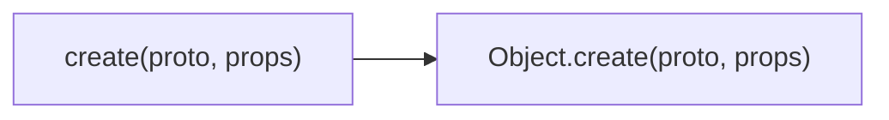

Creates an object with specified prototype.
**Deprecated**: Use `Object.create()` directly.

```mermaid
flowchart LR
    A["create(proto, props)"] --> B["Object.create(proto, props)"]
```

### Native Equivalent

```typescript
// ❌ create(proto, props)
// ✅ Object.create(proto, props)
```
