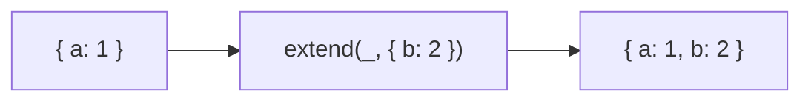

Assigns source properties to destination (alias for assign).
**Deprecated**: Use `Object.assign()` or spread operator.


### Native Equivalent

```typescript
// ❌ extend(target, source)
// ✅ Object.assign(target, source)
// ✅ { ...target, ...source }
```
