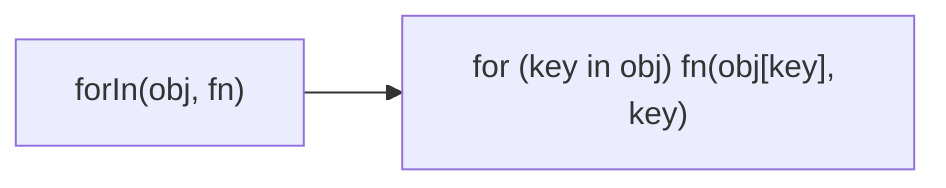

Iterates over own and inherited enumerable properties.
**Deprecated**: Use `for...in` loop directly.


### Native Equivalent

```typescript
// ❌ forIn(obj, fn)
// ✅ for (const key in obj) fn(obj[key], key, obj)
```
