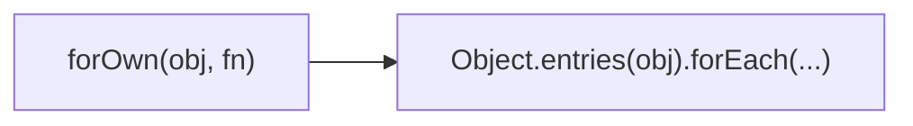

Iterates over own enumerable properties.
**Deprecated**: Use `Object.entries()` with `forEach`.


### Native Equivalent

```typescript
// ❌ forOwn(obj, fn)
// ✅ Object.entries(obj).forEach(([k, v]) => fn(v, k, obj))
```
