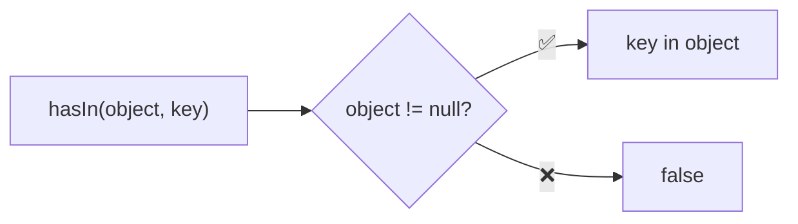
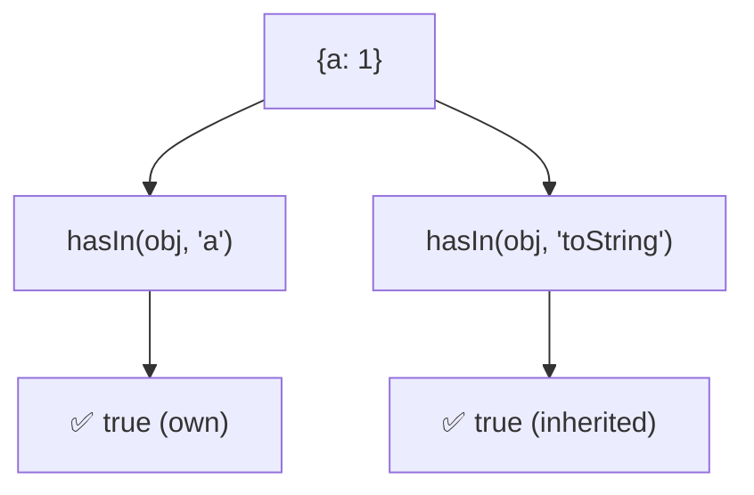

Checks if key exists as direct or inherited property.

### Inheritance Check

### Common Checks

| Object | Key | Result |
|--------|-----|--------|
| `{a: 1}` | `'a'` | ✅ true |
| `{a: 1}` | `'toString'` | ✅ true (inherited) |
| `{a: 1}` | `'b'` | ❌ false |
| `null` | `'a'` | ❌ false |

> ⚠️ **Deprecated**: Use the `in` operator directly.
