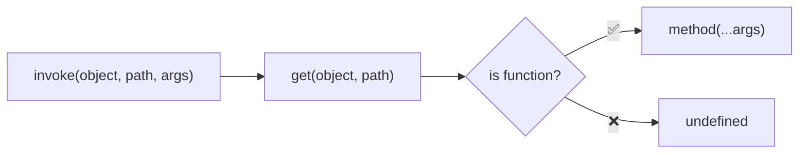
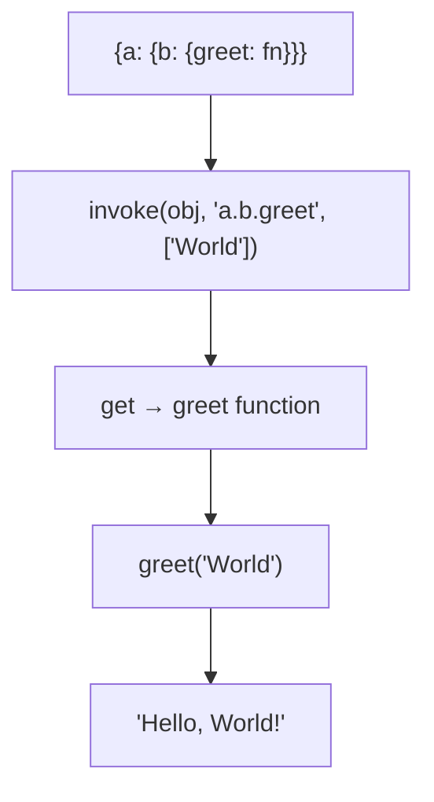

Invokes method at path with given arguments.

### Processing Flow

### Common Inputs

| Object | Path | Args | Result |
|--------|------|------|--------|
| `{greet: n => 'Hi ' + n}` | `'greet'` | `['Bob']` | `'Hi Bob'` |
| `{a: 1}` | `'a'` | `[]` | `undefined` |

> ⚠️ **Deprecated**: Use `get(obj, path)?.(...args)` or optional chaining.
