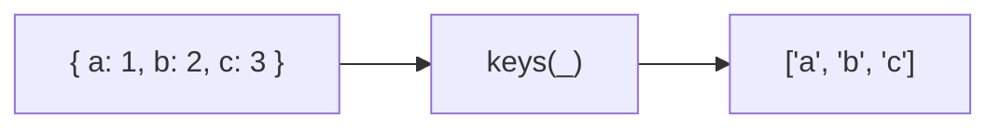

Creates an array of own enumerable property names.
**Deprecated**: Use `Object.keys()` directly (ES5).

```mermaid
flowchart LR
    A["{ a: 1, b: 2, c: 3 }"] --> B["keys(_)"]
    B --> C["['a', 'b', 'c']"]
```

### Native Equivalent

```typescript
// ❌ keys(obj)
// ✅ Object.keys(obj)
```
