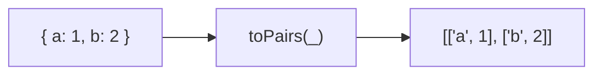

Creates an array of key-value pairs.
**Deprecated**: Use `Object.entries()` directly (ES2017).

```mermaid
flowchart LR
    A["{ a: 1, b: 2 }"] --> B["toPairs(_)"]
    B --> C["[['a', 1], ['b', 2]]"]
```

### Native Equivalent

```typescript
// ❌ toPairs(obj)
// ✅ Object.entries(obj)
```
