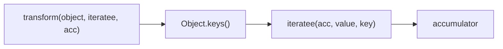
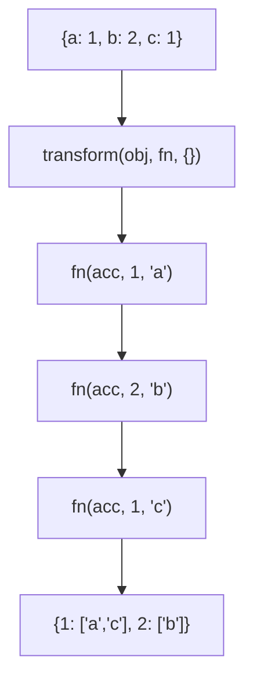

Iterates object properties and accumulates a result.

### Processing Flow

### Common Inputs

| Object | Iteratee | Initial | Result |
|--------|----------|---------|--------|
| `{a: 1, b: 2}` | `(r,v,k) => r[v] = k` | `{}` | `{1: 'a', 2: 'b'}` |

> ⚠️ **Deprecated**: Use `Object.entries().reduce()` directly.
