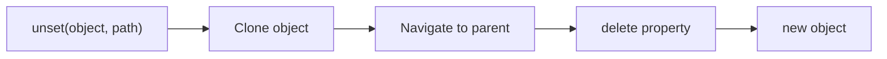
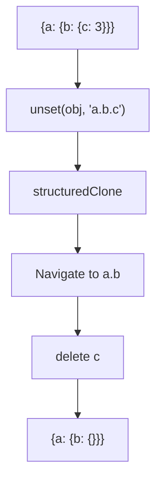

Removes property at path, returning new object (immutable).

### Processing Flow

### Common Inputs

| Object | Path | Result |
|--------|------|--------|
| `{a: {b: {c: 3}}}` | `'a.b.c'` | `{a: {b: {}}}` |
| `{x: 1, y: 2}` | `'x'` | `{y: 2}` |

> ⚠️ **Deprecated**: Use destructuring or `omit` for immutable removal.
