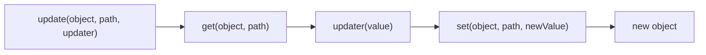
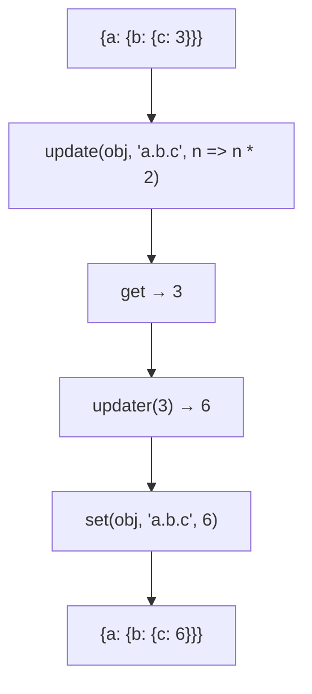

Updates value at path using updater function (immutable).

### Processing Flow

### Common Inputs

| Object | Path | Updater | Result |
|--------|------|---------|--------|
| `{a: {b: 3}}` | `'a.b'` | `n => n * 2` | `{a: {b: 6}}` |
| `{count: 0}` | `'count'` | `n => n + 1` | `{count: 1}` |

> ⚠️ **Deprecated**: Use `set(obj, path, fn(get(obj, path)))` directly.
