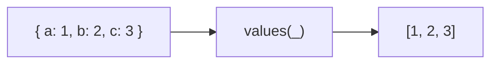

Creates an array of own enumerable property values.
**Deprecated**: Use `Object.values()` directly (ES2017).

```mermaid
flowchart LR
    A["{ a: 1, b: 2, c: 3 }"] --> B["values(_)"]
    B --> C["[1, 2, 3]"]
```

### Native Equivalent

```typescript
// ❌ values(obj)
// ✅ Object.values(obj)
```
