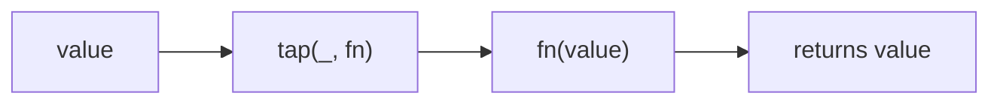

Invokes interceptor and returns the value.
**Deprecated**: Use inline function or console.log directly.


### Native Equivalent

```typescript
// ❌ tap(value, console.log)
// ✅ (console.log(value), value)
```
