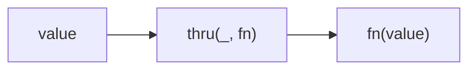

Passes value through a transformer function.
**Deprecated**: Just call the function directly.

```mermaid
flowchart LR
    A["value"] --> B["thru(_, fn)"]
    B --> C["fn(value)"]
```

### Native Equivalent

```typescript
// ❌ thru(value, fn)
// ✅ fn(value)
```
