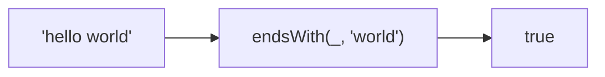

Checks if string ends with the given target.
**Deprecated**: Use `string.endsWith()` directly (ES2015).


### Native Equivalent

```typescript
// ❌ endsWith('hello', 'lo')
// ✅ 'hello'.endsWith('lo')
```
