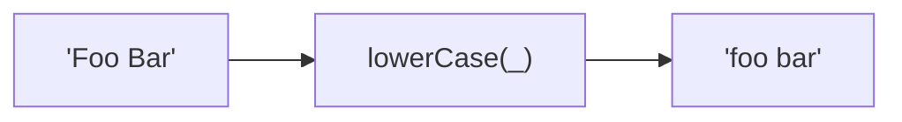

Converts string to space-separated lowercase words.
**Deprecated**: Use words + join manually.


### Native Equivalent

```typescript
// ❌ lowerCase(str)
// ✅ str.toLowerCase().replace(/[_-]+/g, ' ')
```
