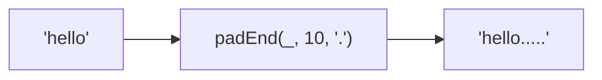

Pads the end of a string to a target length.
**Deprecated**: Use `string.padEnd()` directly (ES2017).


### Native Equivalent

```typescript
// ❌ padEnd('hello', 10, '.')
// ✅ 'hello'.padEnd(10, '.')
```
