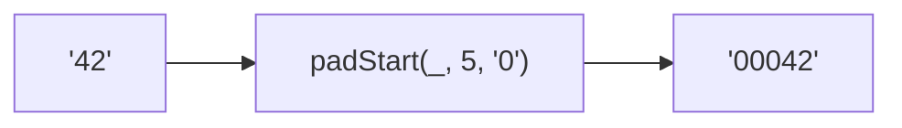

Pads the start of a string to a target length.
**Deprecated**: Use `string.padStart()` directly (ES2017).


### Native Equivalent

```typescript
// ❌ padStart('42', 5, '0')
// ✅ '42'.padStart(5, '0')
```
