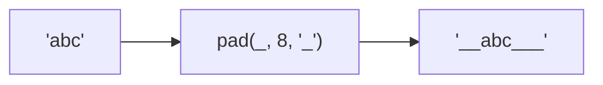

Pads string on both sides to target length.
**Deprecated**: Use `padStart()` and `padEnd()` combination.


### Native Equivalent

```typescript
// ❌ pad(str, length, chars)
// ✅ str.padStart((str.length + length) / 2, chars).padEnd(length, chars)
```
