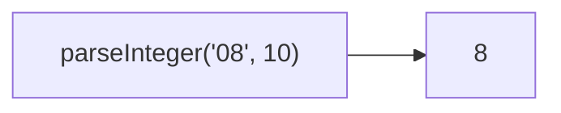

Parses string to integer with radix.
**Deprecated**: Use `parseInt()` directly.

```mermaid
flowchart LR
    A["parseInteger('08', 10)"] --> B["8"]
```

### Native Equivalent

```typescript
// ❌ parseInteger(str, 10)
// ✅ parseInt(str, 10)
```
