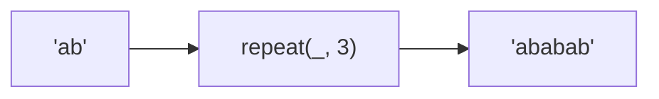

Repeats a string n times.
**Deprecated**: Use `string.repeat()` directly (ES2015).

```mermaid
flowchart LR
    A["'ab'"] --> B["repeat(_, 3)"]
    B --> C["'ababab'"]
```

### Native Equivalent

```typescript
// ❌ repeat('ab', 3)
// ✅ 'ab'.repeat(3)
```
