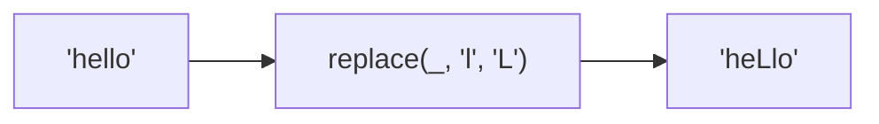

Replaces matches in string.
**Deprecated**: Use `string.replace()` directly.


### Native Equivalent

```typescript
// ❌ replace(str, pattern, replacement)
// ✅ str.replace(pattern, replacement)
```
