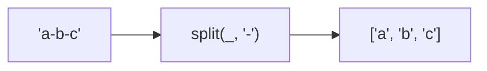

Splits string by separator.
**Deprecated**: Use `string.split()` directly.

```mermaid
flowchart LR
    A["'a-b-c'"] --> B["split(_, '-')"]
    B --> C["['a', 'b', 'c']"]
```

### Native Equivalent

```typescript
// ❌ split(str, '-')
// ✅ str.split('-')
```
