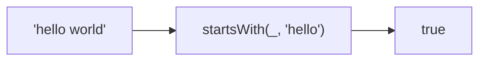

Checks if string starts with the given target.
**Deprecated**: Use `string.startsWith()` directly (ES2015).


### Native Equivalent

```typescript
// ❌ startsWith('hello', 'he')
// ✅ 'hello'.startsWith('he')
```
