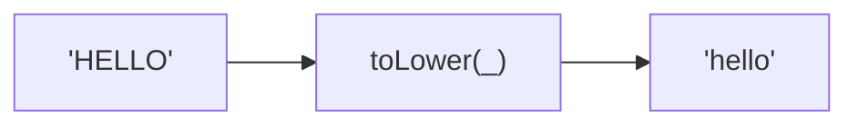

Converts string to lowercase.
**Deprecated**: Use `string.toLowerCase()` directly.

```mermaid
flowchart LR
    A["'HELLO'"] --> B["toLower(_)"]
    B --> C["'hello'"]
```

### Native Equivalent

```typescript
// ❌ toLower('HELLO')
// ✅ 'HELLO'.toLowerCase()
```
