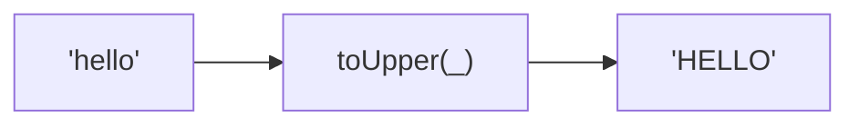

Converts string to uppercase.
**Deprecated**: Use `string.toUpperCase()` directly.

```mermaid
flowchart LR
    A["'hello'"] --> B["toUpper(_)"]
    B --> C["'HELLO'"]
```

### Native Equivalent

```typescript
// ❌ toUpper('hello')
// ✅ 'hello'.toUpperCase()
```
