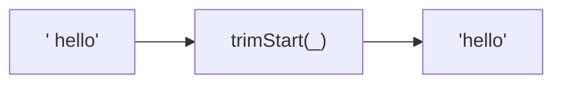

Removes whitespace from start of string.
**Deprecated**: Use `string.trimStart()` directly (ES2019).

```mermaid
flowchart LR
    A["'  hello'"] --> B["trimStart(_)"]
    B --> C["'hello'"]
```

### Native Equivalent

```typescript
// ❌ trimStart(str)
// ✅ str.trimStart()
```
