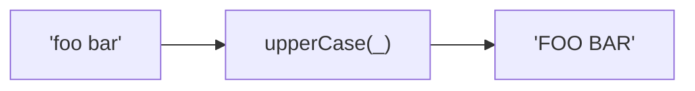

Converts string to space-separated uppercase words.
**Deprecated**: Use words + join manually.


### Native Equivalent

```typescript
// ❌ upperCase(str)
// ✅ str.toUpperCase().replace(/[_-]+/g, ' ')
```
