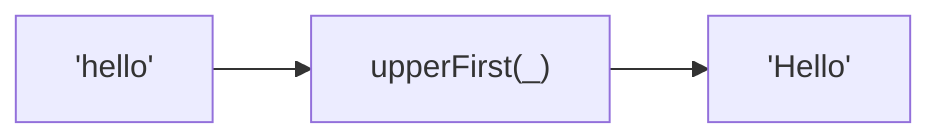

Converts the first character to uppercase.
**Deprecated**: Use `str[0].toUpperCase() + str.slice(1)` directly.


### Native Equivalent

```typescript
// ❌ upperFirst('hello')
// ✅ 'hello'[0].toUpperCase() + 'hello'.slice(1)
```
